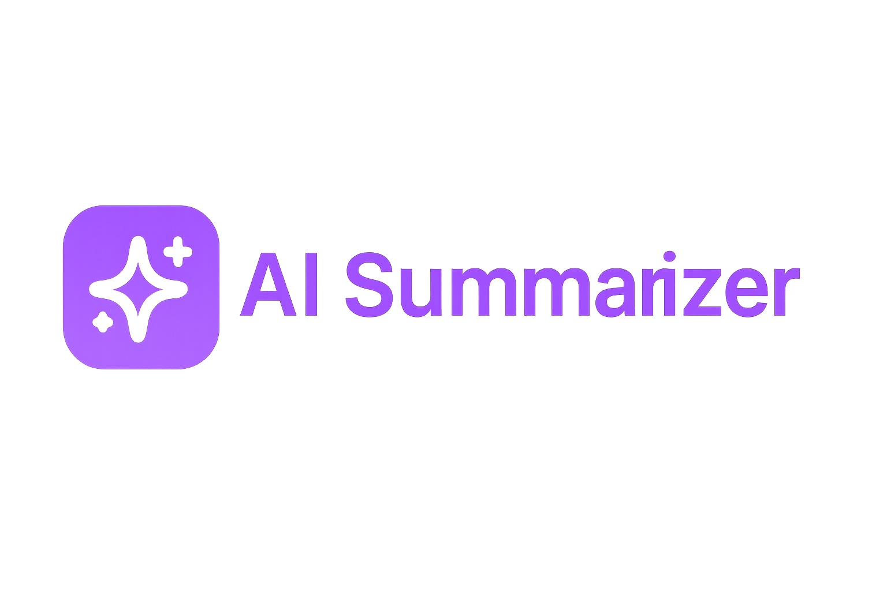

<div align="center">
  
</div>

# 🔍 AI Summarizer – Chrome Extension

**AI Summarizer** is a lightweight Chrome Extension that uses the power of **Groq's LLaMA 3 model** to generate quick summaries of any webpage or selected content. Designed with a clean popup interface, it saves your recent summaries and works even with highlighted PDF text.

> ⚠️ **This extension is not yet published on the Chrome Web Store**. You can still install it manually using the steps below.

---

## ✨ Features

- ✅ One-click summarization of full web pages  
- ✅ Right-click to summarize selected text  
- ✅ Uses [Groq](https://groq.com/) API (LLaMA 3 support)  
- ✅ Saves your last 10 summaries in history  
- ✅ Responsive, modern UI  

---

## 🚀 How to Install (Manual Load)

1. **Download or clone this repository**
2. Open Chrome and navigate to:  
   `chrome://extensions`
3. In the top-right, enable **Developer mode**
4. Click **Load unpacked**
5. Select the extracted project folder

You’ll now see the **AI Summarizer** icon appear in your extensions toolbar.

---

## 🔐 Add Your API Key

This extension requires a **Groq API key** to function.

1. Visit [https://console.groq.com/keys](https://console.groq.com/keys)
2. Copy your API key
3. Open these two files in the project folder:
   - `popup.js`
   - `background.js`
4. Replace:
```js
"Authorization": "Bearer YOUR_API_KEY_HERE"
```
with:
```js
"Authorization": "Bearer YOUR_REAL_API_KEY"
```

> ☑️ Your API key is used only in your browser and is **never sent anywhere else**.

---

## 🧑‍💻 Usage

- Click the **AI Summarizer** icon
- Press **“Summarize Page”** to generate a summary of the current page
- Or, **select any text**, right-click and choose **“🔍 Summarize This Text”**
- Scroll down in the popup to see your saved **history of summaries**

---

## 🧠 Summary History

Your last 10 summaries (input + output) are stored using `chrome.storage.local` and are viewable in the extension popup.

---

## 📦 Built With

- JavaScript, HTML, CSS  
- Chrome APIs: `contextMenus`, `scripting`, `storage`  
- [Groq LLaMA 3](https://console.groq.com/docs)

---

## 🧭 Planned Features

- [ ] PDF file uploads for full summaries  
- [ ] Dark mode UI switch  
- [ ] Export summary as .txt  
- [ ] Optional backend API relay for higher limits  

---

## ⚠️ Chrome Web Store

This extension is **not yet published** on the Chrome Web Store.  
You must use **Developer Mode** to load it manually.

---

## 🧑‍🎨 Crafted By

Made with ❤️ by **Aryan Malkani**
